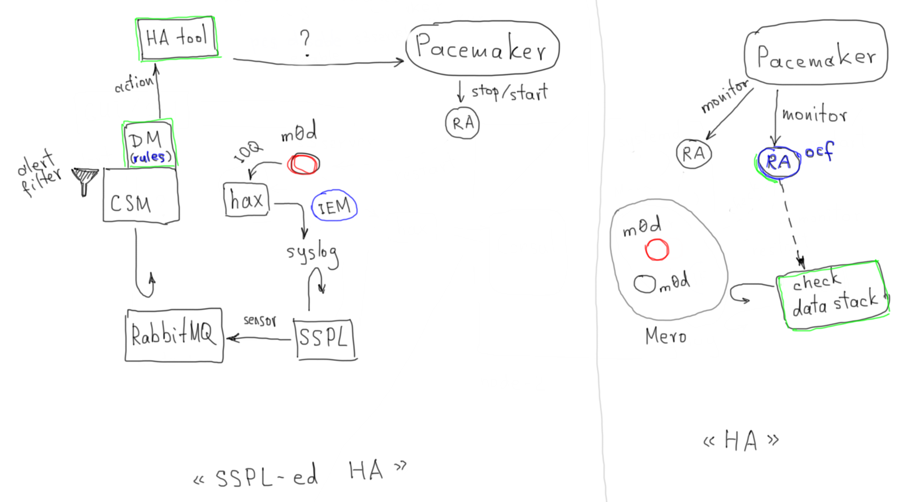

## Language

The key words "MUST", "MUST NOT", "REQUIRED", "SHALL", "SHALL NOT",
"SHOULD", "SHOULD NOT", "RECOMMENDED", "MAY", and "OPTIONAL" in this
document are to be interpreted as described in
[RFC 2119](https://tools.ietf.org/html/rfc2119).

## Examples

### s3server I/O error

Sequence of events:

1. s3server gets an I/O error.
2. s3server puts an IEM into the syslog.
3. SSPL is monitoring the syslog.  It notices an IEM in the syslog,
   generates an alert message and passes it to RabbitMQ.
4. CSM fetches the alert from RabbitMQ.
5. CSM invokes the Decision Maker (DM).
6. DM filters out unimportant alerts.
7. DM applies "rules": if the alert matches predefined _criteria_, a
   corresponding _action_ is taken.
8. DM's action is to invoke the "HA tool" (`hctl`).
9. HA tool invokes Pacemaker (e.g., `sudo pcs restart s3server-resource-name`).

### m0d I/O error

## References

- [EESv1_M4_Architecture slides][m4-arc-slides]

[m4-arc-slides]: https://seagatetechnology-my.sharepoint.com/:p:/r/personal/ujjwal_lanjewar_seagate_com/_layouts/15/guestaccess.aspx?e=4%3AEcSrmG&at=9&CID=a60887cb-880f-9b62-0fb6-e7a0e4f44415&share=EQejLLrH9VxLtmHOsiG8dcoB0J9LtyGmThjm_ZFH7AcooQ
