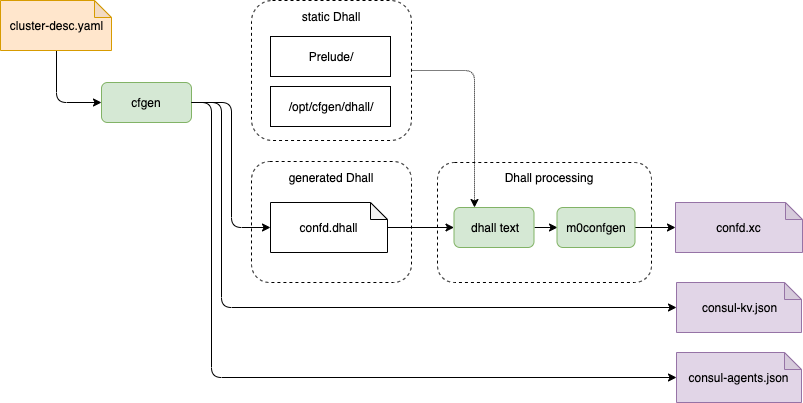

## Configuration Generation



### `collect-facts`

```
usage: collect-facts [-o <output-dir>] [--mock]

optional arguments:
  -h, --help     show this help message and exit
  --help-schema  show cluster description file schema
  -o output-dir  directory to store generated files in (defaults to
                 'collected-facts')
  --mock         Generate pseudo-random "facts". The hosts specified in the
                 cluster description file will not be visited and don't even
                 have to exist.
  -V, --version  show program's version number and exit

The program reads cluster description in YAML format from the standard input;
'--help-schema' option shows the schema.
```

**collect-facts** ssh-es to the hosts mentioned in the cluster description file, collects "facts" about them (e.g., `facter --json processors | jq .processors.count`, `facter memorysize_mb`) and saves that data locally as [Dhall](https://dhall-lang.org/) expressions (`cluster-facts/*.dhall`).

### `cfgen`

**cfgen** runs a particular Dhall processing pipeline, selected via CLI option.

`cfgen --confd` outputs Mero configuration in xcode string format, ready to be consumed by confd services.

`cfgen --kv` outputs KV pairs in JSON format, ready to be consumed by [`consul kv import`](https://www.consul.io/docs/commands/kv/import.html).

`cfgen --etc m0d` outputs /etc configuration for m0d process.
