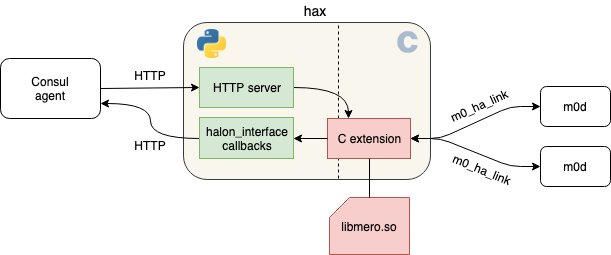

## Language

The key words "MUST", "MUST NOT", "REQUIRED", "SHALL", "SHALL NOT", "SHOULD", "SHOULD NOT", "RECOMMENDED",  "MAY", and "OPTIONAL" in this document are to be interpreted as described in RFC 2119 (see "[Key words for use in RFCs to Indicate Requirement Levels](http://tools.ietf.org/html/rfc2119)").

## HA link eXtender (hax)

Mero process and Consul agent cannot communicate directly.  They communicate over `hax` server — a bridge, one side of which accepts connections from Mero processes, the other side communicates with Consul agent over HTTP.



The code of `hax` consists of C and Python parts.

* C part maintains HA link (`m0_ha_link`) connections with one or more `m0d` processes.  The code uses `m0_halon_interface` API.
* The callback functions passed to `m0_halon_interface_start()` are defined in the Python code.  Callback handlers (e.g., `entrypoint_request_cb`, `msg_received_cb`) send HTTP requests to Consul.
* Python part also runs HTTP server.  This server receives HTTP POST request from a Consul's watch handler with payload of HA state updates.

## Fids for `m0_halon_interface_start()`

`hax` has to pass 3 fid parameters to `m0_halon_interface_start()`:
- process fid (<0x72...:...>) of the current process (the `hax` itself);
- HA service fid (<0x73...:...>) — fid of the HA service run by current process;
- RM service fid — fid of the RM service run by current process.

When `hax` is starting up, it fetches its process fid from Consul:
```
$ curl -s \
    http://localhost:8500/v1/catalog/service/hax?filter=Node==$(hostname) |
    jq -r '.[] | .ServiceID'
0x7200000000000001:0x007d
```

HA service fid is obtained from the process fid by changing the most significant byte of `.f_container` to 0x73 and incrementing `.f_key`.

RM service fid is obtained by incrementing `.f_key` of the HA service fid.

Example:
```
0x7200000000000001:0x7d -- hax process fid (received from Consul)
0x7300000000000001:0x7e -- HA service fid (MSB of .f_container changed to 0x73, .f_key incremented)
0x7300000000000001:0x7f -- RM service fid (.f_key incremented)
```

**Notes:**

1. HA and RM fids are not stored in Consul.
2. Hare bootstrap MUST guarantee uniqueness of the fids, generated by the above algorithm.

## Incoming HTTP requests

`hax` receives HTTP POST requests from Consul's [watch handler](https://www.consul.io/docs/agent/watches.html#http-endpoint).  The payload is JSON formatted data with the following structure:

```json
[{
    "Node": {
        "ID": "1e980571-4a55-bb9d-5eca-e37c06eead07",
        "Node": "sage75",
        "Address": "192.168.180.162",
        "Datacenter": "dc1",
        "TaggedAddresses": {
            "lan": "192.168.180.162",
            "wan": "192.168.180.162"
        },
        "Meta": {
            "consul-network-segment": ""
        },
        "CreateIndex": 5,
        "ModifyIndex": 6
    },
    "Service": {
        "ID": "0x7200000000000001:0x0004",
        "Service": "confd",
        "Tags": [],
        "Meta": null,
        "Port": 101,
        "Address": "@tcp:12345:44",
        "Weights": {
            "Passing": 1,
            "Warning": 1
        },
        "EnableTagOverride": false,
        "CreateIndex": 6,
        "ModifyIndex": 6,
        "Proxy": {
            "DestinationServiceName": "",
            "Upstreams": null
        },
        "Connect": {}
    },
    "Checks": [{
        "Node": "sage75",
        "CheckID": "serfHealth",
        "Name": "Serf Health Status",
        "Status": "passing",
        "Notes": "",
        "Output": "Agent alive and reachable",
        "ServiceID": "",
        "ServiceName": "",
        "ServiceTags": [],
        "Definition": {
            "Interval": "0s",
            "Timeout": "0s",
            "DeregisterCriticalServiceAfter": "0s",
            "HTTP": "",
            "Header": null,
            "Method": "",
            "TLSSkipVerify": false,
            "TCP": ""
        },
        "CreateIndex": 5,
        "ModifyIndex": 5
    }, {
        "Node": "sage75",
        "CheckID": "service:0x7200000000000001:0x0004",
        "Name": "Service 'confd' check",
        "Status": "passing",
        "Notes": "",
        "Output": "",
        "ServiceID": "0x7200000000000001:0x0004",
        "ServiceName": "confd",
        "ServiceTags": [],
        "Definition": {
            "Interval": "0s",
            "Timeout": "0s",
            "DeregisterCriticalServiceAfter": "0s",
            "HTTP": "",
            "Header": null,
            "Method": "",
            "TLSSkipVerify": false,
            "TCP": ""
        },
        "CreateIndex": 6,
        "ModifyIndex": 72
    }]
}]
```

## Threading model

### Is `m0_thread_adopt` necessary?

Mero functions - including FFI callbacks triggered by Mero - _may_ require that the threads they run on have thread-local storage (TLS) initialised in a specific way.  The threads managed by Python runtime do not meet this assumption, unless `hax` code makes `m0_thread_adopt` calls in proper places (`m0_thread_adopt` performs TLS initialisation as required by Mero).  The question is, whether Mero code executed by `hax` will actually _depend_ on Mero-specific TLS?  The most likely answer is “yes”.

### Some facts about Python threads

1. Threads created with [threading](https://docs.python.org/3/library/threading.html) API or with lower level [_thread](https://docs.python.org/3/library/_thread.html) API are not green threads.
2. Every time Python interpreter creates a thread on Linux platform, a new pthread (POSIX thread) is created.  Python thread never changes the underlying pthread.
3. The Python Global Interpreter Lock (GIL) is a mutex that allows only one thread to hold the control of the Python interpreter.  This means that only one thread can be in a state of execution at any point in time.

### Useful links

* `PyThread_start_new_thread` function ([source](https://github.com/python/cpython/blob/3.7/Python/thread_pthread.h#L179))
* [Coding patterns for Python extensions](https://pythonextensionpatterns.readthedocs.io/en/latest/)
