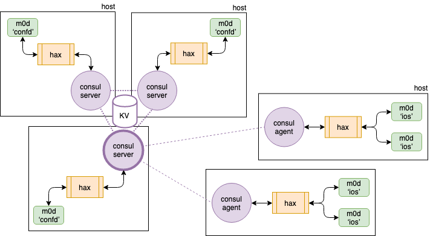

## Language

The key words "MUST", "MUST NOT", "REQUIRED", "SHALL", "SHALL NOT",
"SHOULD", "SHOULD NOT", "RECOMMENDED", "MAY", and "OPTIONAL" in this
document are to be interpreted as described in
[RFC 2119](https://tools.ietf.org/html/rfc2119).

## Mero cluster bootstrap

Cluster administrator

1. Prepares the
   [cluster description file](rfc/3/README.md#cluster-description-file).

1. Runs `bootstrap` script, passing it the cluster description file
   via standard input.  The script MAY be started on any node of the
   cluster.

The `bootstrap` script

1. Executes [‘cfgen’ script](rfc/3/README.md#cfgen), which generates
   `bootstrap-env`, `consul-config.json`, `consul-kv.json`, and
   `confd.xc` files.

1. Starts `consul` agents, knowing from `bootstrap-env` file where
   server and client agents should be running.

1. Initialises [Consul KV](rfc/4/README.md) by executing
   `consul kv import @consul-kv.json` command.

1. Starts `hax` on every node of the cluster.  Each `hax` process
   obtains its [three fids](#8) from the Consul KV.

1. Starts ‘confd’ Mero servers on the Consul server nodes.  For each
   confd Mero server:

   - obtains host name and process fid from the Consul KV;
   - uploads `confd.xc` file;
   - starts `m0mkfs` process;
   - waits for `m0mkfs` to terminate;
   - starts `m0d` process.

1. Waits for ‘confd’ servers to start.

1. Starts other (non-confd) Mero servers.  For each non-confd Mero
   server:

   - obtains host name and process fid from the Consul KV;
   - starts `m0mkfs` process;
   - waits for `m0mkfs` to terminate;
   - starts `m0d` process(es).

**Note:** `bootstrap` waits for a Mero process by polling status of
the corresponding Consul service; see
[5/HAX](rfc/5/README.md#storing-process-status-in-consul-kv) for more
details.

## Design Highlights

* Mero ‘confd’ services SHALL be collocated with Consul server agents.
* Several ‘confd’ service SHALL NOT be running on the same node.
* Several Mero servers MAY be running on the same node.
